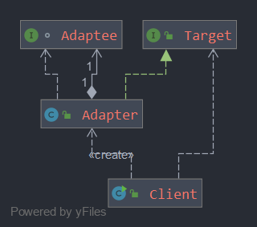

### Adapter Pattern - 适配器模式

适配器模式将一个接口转换成用户所需要的接口，所解决的问题是接口的不兼容问题。

#### 1.1 对象适配器

利用组合，将被适配对象包装在适配器内部（如上图）

#### 1.2 类适配器

利用继承，实现被适配的类，一般是多重继承

#### 2 适配器模式与装饰器模式有什么区别？

- 装饰器模式不会改变原来的接口，只扩展接口的行为
- 适配器模式改变了接口的类型

#### 3 适配器模式与外观模式有什么区别？

- 适配器模式的意图是转换成客户需要的接口
- 外观模式的目的是为系统提供一个简化的接口，对系统进行了一个封装，使系统更易使用，对于原来的接口仍然是可用的